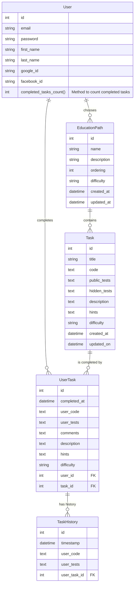
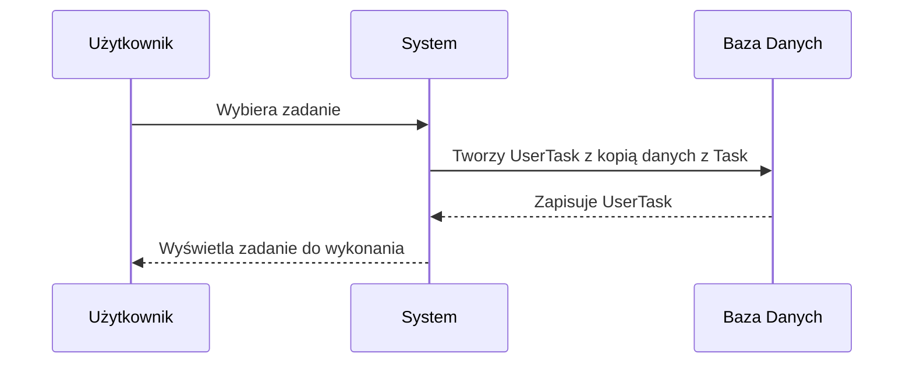
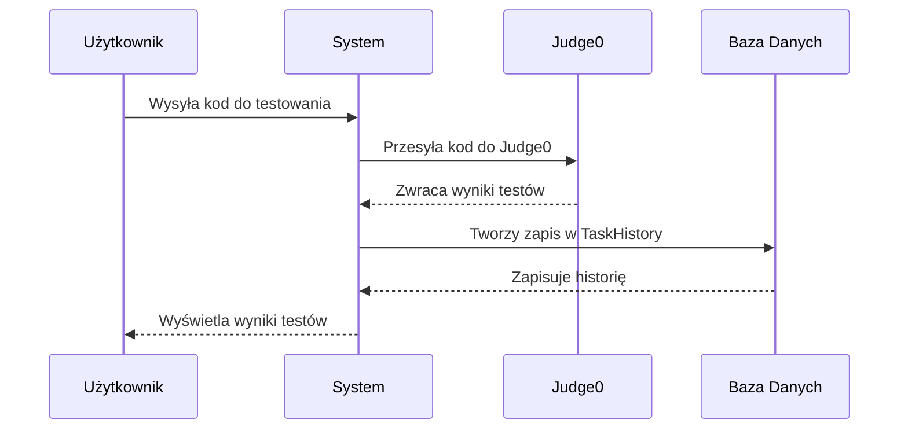
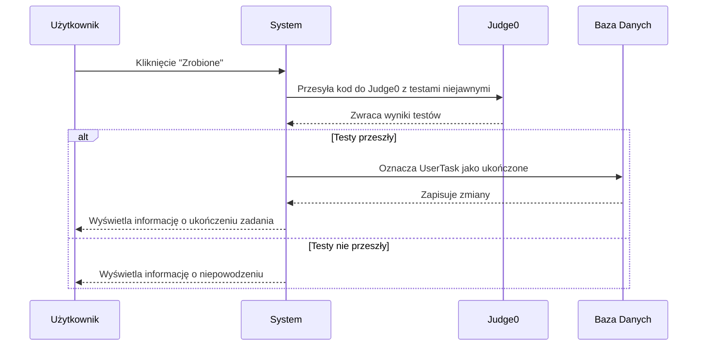

# Coding Platform

For PyMasters

**Note:** This document needs updates.

## Testing

We use [Pytest](https://docs.pytest.org/) for automated testing.

### Running Tests

1. Start the project environment:

    ```bash
    poetry shell
    ```

2. Run tests in the project directory:

    ```bash
    pytest -n auto -vv
    ```

   This command runs tests in parallel for faster results. Ensure all tests pass before creating a pull request (PR). Merges are blocked if tests fail.

### Writing Your Own Tests

Contributions are welcome! Place tests in the `tests` directory of a module (include `__init__.py`). Name files `test_{name}.py`, e.g., `test_models.py`. Each test must start with `test_`.

**Tip:** Test-driven development (TDD) is encouraged. For more, watch [this video](https://www.youtube.com/watch?v=xn3wSM82fnA). Writing tests post-code is also fine. Practice and ask questions!

## Connecting Gmail to the Application

Enable registration by setting email data in your `.env` file:

```ini
EMAIL_BACKEND = 'django.core.mail.backends.smtp.EmailBackend'
EMAIL_HOST = 'smtp.gmail.com'
EMAIL_PORT = 587
EMAIL_HOST_USER = 'your_email@gmail.com'
EMAIL_USE_TLS = True
```

### Option 1: Use Your Password

```ini
EMAIL_HOST_PASSWORD = 'your_password'
```

### Option 2: Use an App Password

1. Go to [Google Account Security](https://myaccount.google.com/security).
2. Enable [2-Step Verification](https://myaccount.google.com/signinoptions/twosv).
3. Generate an [App Password](https://myaccount.google.com/apppasswords).
4. Use the generated password in your `.env` file:

   ```ini
   EMAIL_HOST_PASSWORD = 'your_app_password'
   ```

## Setting Up Google Login in Django

### Step 1: Create Google OAuth Credentials

1. Visit [Google Cloud Console](https://console.cloud.google.com/).
2. Create a new project if necessary.
3. Enable the OAuth consent screen and fill in required fields.

### Step 2: Set Up OAuth Credentials

1. Navigate to **API & Services > Credentials**.
2. Create an **OAuth client ID** for a Web application.
3. Add authorized URIs, e.g., `http://127.0.0.1:8000`.

### Step 3: Configure Your `.env` File

Add these variables:

```ini
GOOGLE_OAUTH2_KEY='your_client_id'
GOOGLE_OAUTH2_SECRET='your_client_secret'
```

## Ruff Formatting and Linting

### Linting

```bash
ruff check                  # Lint all files in the current directory.
ruff check --fix            # Fix fixable errors.
ruff check --watch          # Re-lint on change.
ruff check path/to/code/    # Lint specific path.
```

### Formatting

```bash
ruff format                   # Format all files.
ruff format path/to/code/     # Format specific path.
ruff format path/to/file.py   # Format a single file.
ruff format --check           # Check formatting without changing files.
```

For more, visit [Ruff Linter](https://docs.astral.sh/ruff/linter/) and [Ruff Formatter](https://docs.astral.sh/ruff/formatter/).

### Database design




### Diagramy przepływu

#### Proces rozpoczęcia pracy nad zadaniem



#### Proces testowania rozwiązania zadania




#### Proces oznaczania zadania jako ukończone

